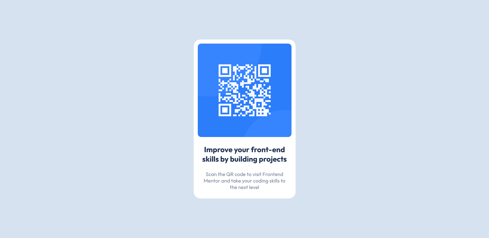

# Frontend Mentor - QR code component solution

This is a solution to the [QR code component challenge on Frontend Mentor](https://www.frontendmentor.io/challenges/qr-code-component-iux_sIO_H). Frontend Mentor challenges help you improve your coding skills by building realistic projects. 

## Table of contents

- [Overview](#overview)
  - [Screenshot](#screenshot)
  - [Links](#links)
- [My process](#my-process)
  - [Built with](#built-with)
  - [What I learned](#what-i-learned)
  - [Continued development](#continued-development)
- [Author](#author)

**Note: Delete this note and update the table of contents based on what sections you keep.**

## Overview

### Screenshot

Desktop Design.

Mobile Design.

### Links

- Solution URL: [github](https://github.com/Akanni5/QRCODE-COMPONENT-FM)
- Live Site URL: [qrcode-component-fm-virid.vercel.app/](https://qrcode-component-fm-virid.vercel.app)

## My process

### Built with

- Semantic HTML5 markup
- CSS custom properties
- Flexbox

### What I learned

I've never really used the `hsl(..., ..., ...)` in CSS, before now, I've always used hexadecimal values or `rgba` in CSS. Seeing the `hsl`, I was excited to learn about it.

### Continued development

I'm not completely comfortable with semantic html markup. I'm deeming to learn and master it. Also, I have issue figuring out the right `font-size`, `margin`, `gap` and `padding` for my design, I had to use a trial-error method. Now, I think i've a method to approach this issue.

## Author

- Blog - [techroyal at hashnode](https://techroyal.hashnode.dev/)

- Twitter - [@coderoyalty](https://www.twitter.com/coderoyalty)
